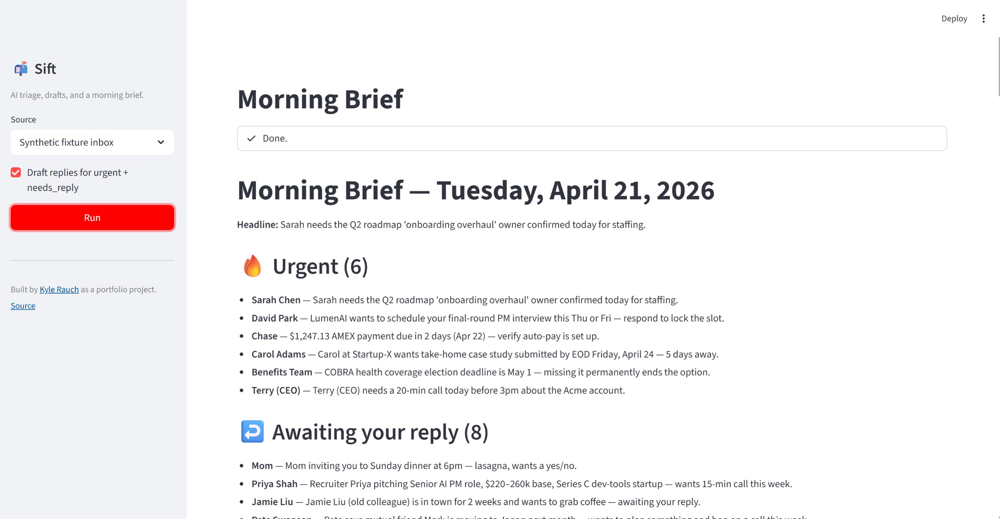
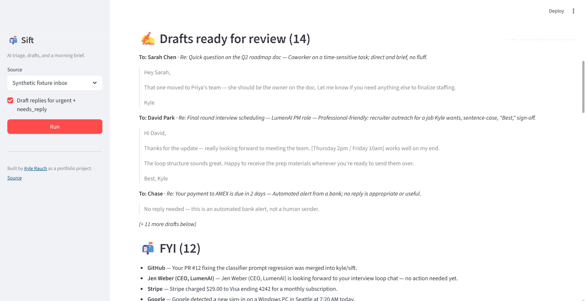

# Sift

> An AI assistant that triages your Gmail, drafts replies in your voice, and gives you a morning brief — with an evals harness that measures whether it's actually any good.

Built by [Kyle Rauch](mailto:kyle.g.rauch@gmail.com) as a portfolio project demonstrating end-to-end AI product work: prompt engineering, structured LLM output, multi-provider abstraction, and evals as a first-class deliverable.

---

## TL;DR

```bash
git clone <this-repo>
cd sift
python -m venv .venv && source .venv/bin/activate      # or .venv\Scripts\activate on Windows
pip install -e ".[dev]"
cp .env.example .env                                    # add at least one provider API key
sift brief --source fixtures                            # runs the pipeline against a synthetic inbox
sift auth                                               # (optional) authenticate Gmail
sift brief --source gmail --limit 20                    # run against your real inbox
sift push-drafts --limit 10                             # land AI-drafted replies in Gmail Drafts
pytest evals/                                           # runs the eval suite
streamlit run src/app.py                                # optional GUI
```

Everything runs against a hand-labeled **synthetic inbox of 40 threads** out of the box — no Gmail setup required to see the pipeline end-to-end. To point it at your real Gmail, follow [`docs/gmail_setup.md`](docs/gmail_setup.md).

---

## Why I built this

Email is where my attention goes to die. Most messages need one of four responses — *reply now*, *file for later*, *delete*, *ignore* — and the triage decision usually takes longer than the reply itself. Existing tools (Superhuman, Hey, Shortwave) do the job well but are closed boxes that don't let me see, tune, or eval the reasoning.

Sift is (a) a tool I actually want to use every morning, and (b) a portfolio artifact for how I design and *measure* LLM-powered systems end-to-end. Importantly, it's not "a wrapper around Claude" — it's a well-structured pipeline with an eval harness that tells me when I've made things better or worse, and a provider-agnostic LLM layer that lets me swap backends to answer cost/quality questions empirically.

## What it does

1. **Fetches** recent threads from your Gmail inbox (or a synthetic fixture inbox in dev mode).
2. **Triages** each thread into one of five categories: `urgent`, `needs_reply`, `fyi`, `newsletter`, `trash`.
3. **Summarizes** each thread in one line.
4. **Drafts** a reply for `needs_reply` and `urgent` threads in your voice.
5. **Assembles a morning brief** — what needs your attention, what's awaiting a reply, what's noise.
6. **Measures itself.** Every prompt has an eval. Every change is scored against the labeled fixture set — across *every* provider you have an API key for.

It never sends. It only drafts. You stay in the loop.

## What it looks like

**1 · Triaged morning brief.** 40 threads collapsed into one scannable page. The headline surfaces the most time-sensitive item, urgent vs. needs-reply vs. noise is a structured LLM classification (not keyword matching), and the counts tell you at a glance whether today is a fire drill or a quiet inbox.



**2 · Drafted replies, inline.** For every urgent + needs-reply thread, Sift generates a reply draft with tone notes explaining the register it chose (direct-and-brief for the coworker, professional-friendly for the recruiter, no-reply-needed for the automated bank alert). Drafts are never sent — you review, edit, and hit send yourself.



**3 · Pure CLI, no UI required.** The same pipeline runs headless in a terminal, rendered with [Rich](https://github.com/Textualize/rich) — fast to invoke, easy to pipe, and the default I use day-to-day. See the full command reference [below](#usage).

## Architecture

```
                    ┌──────────────┐
Gmail API ─────────▶│ gmail_client │──────┐       fetch threads
                    └──────────────┘      │       + push drafts
Fixture JSON ─────▶ fixtures.py ──────────┤
                                          │
                                          ▼
                                     ┌─────────┐
                                     │  cache  │  SQLite (thread/
                                     └────┬────┘   classification/draft)
                                          │
                    ┌─────────────────────┼─────────────────────┐
                    ▼                     ▼                     ▼
              ┌──────────┐          ┌──────────┐          ┌──────────┐
              │classifier│          │  voice   │          │ drafter  │
              │ (tool-use│          │ profile  │──────────│(free-txt)│
              │  JSON)   │          │ (learned)│          │          │
              └────┬─────┘          └──────────┘          └────┬─────┘
                   │                                           │
                   └───────────────────┬───────────────────────┘
                                       ▼
                                  ┌─────────┐
                                  │  brief  │  deterministic markdown
                                  └────┬────┘
                                       ▼
                                ┌──────────────┐
                                │   CLI / UI   │  Typer + Rich;  Streamlit
                                └──────────────┘
```

All LLM calls go through [`src/sift/llm.py`](src/sift/llm.py), a thin facade over the provider registry in [`src/sift/providers/`](src/sift/providers/). Prompts live in [`src/sift/prompts/`](src/sift/prompts/) as markdown files so they diff cleanly in PRs.

## Multi-provider LLM layer

Sift speaks to **four** LLM providers behind a uniform interface:

| Provider  | Default model              | Structured-output mechanism              |
|-----------|----------------------------|------------------------------------------|
| Anthropic | `claude-sonnet-4-6`        | Tool-use with enforced `input_schema`    |
| OpenAI    | `gpt-4o-mini`              | `response_format` strict JSON-schema     |
| Google    | `gemini-2.5-flash`         | `response_schema` + JSON MIME type       |
| Groq      | `llama-3.3-70b-versatile`  | JSON-mode + schema hint in the prompt    |

Pick one with `LLM_PROVIDER=...` in `.env`. You only need the API key for the provider you're using. Full details in [`docs/providers.md`](docs/providers.md).

The **provider-comparison eval** runs the same classifier against every provider whose API key is set and writes a cost/accuracy/latency table:

```bash
pytest evals/test_provider_comparison.py -v -s
# -> evals/last_provider_comparison.md
```

**Latest run** (40 labeled fixtures, 2026-04-21):

| Provider  | Model                       | Accuracy | $/1k threads | Avg latency |
|-----------|-----------------------------|---------:|-------------:|------------:|
| groq      | `llama-3.3-70b-versatile`   |    97.5% |       $0.75 |     5254 ms |
| anthropic | `claude-sonnet-4-6`         |    95.0% |       $7.58 |     3109 ms |
| openai    | `gpt-4o-mini`               |    92.5% |       $0.19 |     1479 ms |
| google    | `gemini-2.5-flash`          |    90.0% |       $0.46 |     1020 ms |

The interesting takeaway: Llama-3.3-70B on Groq wins on accuracy *and* costs ~10× less than Sonnet on this task, while `gpt-4o-mini` is cheapest-per-thread and Gemini is fastest. This is exactly the kind of empirical answer you can't get from a marketing page — and the reason a provider abstraction is worth building even for a one-person project. Full per-category recall table in [`evals/last_provider_comparison.md`](evals/last_provider_comparison.md).

This is how I answer "which model is cheapest for good-enough quality *on this task*" empirically, rather than guessing from a marketing page.

## Gmail connector

`sift auth` kicks off a one-time OAuth flow (`InstalledAppFlow`, `gmail.readonly` + `gmail.compose` scopes) and caches the token to `token.json`. After that, `sift brief --source gmail` fetches recent threads through the Gmail API and `sift push-drafts` classifies, drafts replies for urgent / needs-reply threads, and posts them as real drafts inside the original Gmail threads (correct `In-Reply-To` / `References` headers so Gmail threads them under the original).

The connector is an *assistive* tool, not an autonomous one — it never sends mail. Drafts land in your Drafts folder, and you review and hit send yourself. See [`docs/gmail_setup.md`](docs/gmail_setup.md) for the Google Cloud setup walkthrough and [`docs/oauth_integration.md`](docs/oauth_integration.md) for the build log, including the two gotchas caught during integration (OAuth client type must be "Desktop app"; `email.utils.parsedate_to_datetime` returns naive datetimes for `-0000` time zones).

## Voice learning

The drafter works out of the box with a hand-written `DEFAULT_VOICE` profile — good enough for demos. But the real value is drafts that sound like *you*, not like generic Claude. `sift learn-voice` pulls ~50 recent messages from your Gmail Sent folder, runs them through a single structured Claude call that extracts a compressed style summary plus three verbatim example replies, and caches the resulting `VoiceProfile` by user email with a weeklong TTL.

```bash
sift learn-voice                  # one-shot learner; caches the profile
sift learn-voice --force          # re-learn even if a fresh profile is cached
sift brief --source gmail         # drafter automatically uses the cached profile
```

The profile is injected into the drafter's system prompt via `render_for_prompt()`, which includes the summary *and* the verbatim examples — LLMs imitate concrete examples much better than abstract style descriptions. See [`src/sift/prompts/voice.md`](src/sift/prompts/voice.md) for the system prompt; the full design is in [`docs/oauth_integration.md`](docs/oauth_integration.md#voice-learning).

**Want to see what voice learning actually does to a draft?** [`docs/voice_example.md`](docs/voice_example.md) walks through a real run on my own inbox: the learned profile, an A/B comparison of the same draft with and without it, and a writeup of a sender/recipient prompt bug I caught when better voice imitation made the draft sound *too* confident. Probably the single most useful demo artifact in this repo.

## SQLite cache

LLM calls aren't free — classifying 20 threads takes ~10–30s of wall-clock on cold runs and hits rate limits hard on starter-tier API keys. Sift caches parsed threads, classifications, and drafts to a local SQLite DB (`sift.db`) keyed by `(thread_id, history_id)`. Gmail bumps `historyId` on any thread change, so the cache auto-invalidates when a thread actually changes and stays stable otherwise. On a warm rerun "five minutes later after some new mail arrived", only the delta hits the LLM.

```bash
sift cache-stats                      # row counts per table
sift cache-clear                      # wipe all cache tables
sift cache-clear classifications      # wipe one table
sift brief --source gmail --no-cache  # bypass the cache for a fresh run
```

## The evals harness

This is the thing that separates an LLM wrapper from AI engineering work. Full writeup in [`docs/design_decisions.md#4-evals-are-the-product`](docs/design_decisions.md#4-evals-are-the-product). Summary:

- **Classifier eval:** per-category precision/recall/F1 against the 40-thread labeled fixture set, with recall floors per category. Recall is weighted over precision because missing an urgent email is more costly than over-flagging one.
- **Drafter eval:** LLM-as-judge with a 5-dimension rubric (addresses-the-ask, register-match, factuality, length-appropriate, no-AI-tells). Not a perfect methodology, but a *repeatable* one — when I change the drafter prompt, this tells me whether average quality moved.
- **Provider comparison:** cross-provider table of accuracy, token usage, latency, and estimated cost for the classifier pipeline.
- **Gated on API keys:** LLM evals are marked with `@pytest.mark.llm` and auto-skipped when no provider key is set, so `pytest evals/` is safe to run in CI or on forks.

Run it:

```bash
pytest evals/                       # full suite (needs at least one provider API key for LLM tests)
pytest evals/ -m "not llm"          # key-free sanity checks (math + fixture parse + table formatting)
```

The eval suite writes [`evals/last_run.md`](evals/last_run.md), [`evals/last_run_drafter.md`](evals/last_run_drafter.md), and [`evals/last_provider_comparison.md`](evals/last_provider_comparison.md) on every run with per-category scores + misclassifications for inspection.

### Latest scores

Run against the 40-thread labeled fixture set with `claude-sonnet-4-6` (2026-04-21):

**Classifier** — 95.0% overall accuracy (38/40). See [`evals/last_run.md`](evals/last_run.md) for full per-category precision/recall/F1 and the misclassification list.

| Category     | Precision | Recall | F1   |
|--------------|----------:|-------:|-----:|
| urgent       |      0.83 |   1.00 | 0.91 |
| needs_reply  |      1.00 |   0.80 | 0.89 |
| fyi          |      0.92 |   1.00 | 0.96 |
| newsletter   |      1.00 |   1.00 | 1.00 |
| trash        |      1.00 |   1.00 | 1.00 |

Both misses are in the `needs_reply` bucket and both are defensible edge cases — a "Q2 roadmap" question read as `urgent`, and a "looking forward to our chat" read as `fyi`. Notable: `needs_reply` precision is 1.00 (the classifier never *falsely* tells you something needs a reply), and recall is 0.80 (it occasionally undersells how much attention a thread needs — which is a much safer failure mode for an inbox assistant than the reverse).

**Drafter** — 4.96 / 5 mean quality score from the 5-dimension LLM-as-judge rubric over the draftable fixtures. Four of five dimensions scored a perfect 5.00. Full per-draft judge rationales in [`evals/last_run_drafter.md`](evals/last_run_drafter.md).

| Dimension          | Avg / 5 |
|--------------------|--------:|
| addresses_ask      |    4.80 |
| register_match     |    5.00 |
| factuality         |    5.00 |
| length_appropriate |    5.00 |
| no_ai_tells        |    5.00 |

## Design decisions (the "why" doc)

See [`docs/design_decisions.md`](docs/design_decisions.md) for the full thing. The one-sentence versions:

1. **Pipeline, not agent.** A fixed sequence of discrete LLM calls is easier to eval, debug, and explain than a tool-using agent — and the inbox problem has a fixed structure, so there's no payoff to the extra variance.
2. **Structured output first.** Every classifier and drafter call goes through a schema-enforced channel (tool-use / response_format / response_schema). No regex-parsing markdown JSON.
3. **Provider-agnostic LLM layer.** One `LLMProvider` ABC; adding a new backend is a single-file change.
4. **Evals are the product.** Every prompt has one. Every change is scored. Cross-provider comparison is built in.
5. **Synthetic inbox first.** All prompt iteration against a labeled fixture set before any real Gmail calls — faster loops and reproducible results.

## Project layout

```
sift/
├── pyproject.toml
├── .env.example
├── README.md
├── docs/
│   ├── design_decisions.md      # the "why" doc
│   ├── gmail_setup.md           # Google Cloud OAuth walkthrough
│   ├── oauth_integration.md     # build log for the Gmail connector + cache
│   └── providers.md             # multi-provider reference
├── src/
│   ├── app.py                   # Streamlit UI
│   └── sift/
│       ├── classifier.py
│       ├── drafter.py
│       ├── brief.py
│       ├── cache.py             # SQLite cache (threads/classifications/drafts)
│       ├── cli.py               # Typer CLI: `sift brief|classify|draft|auth|push-drafts|cache-*`
│       ├── gmail_client.py      # OAuth + fetch + push to Gmail Drafts
│       ├── llm.py               # provider-agnostic facade
│       ├── models.py            # Pydantic schemas
│       ├── fixtures.py
│       ├── voice.py             # voice learner + cache-aware resolver
│       ├── prompts/             # markdown prompt templates
│       │   ├── classify.md
│       │   ├── draft.md
│       │   ├── brief.md
│       │   └── voice.md
│       └── providers/           # one file per LLM backend
│           ├── base.py          # LLMProvider ABC + LLMResult + UsageInfo
│           ├── registry.py      # factory + list_available_providers
│           ├── anthropic.py
│           ├── openai_compat.py # OpenAI + Groq (OpenAI-compatible)
│           └── google.py
├── tests/
└── evals/
    ├── fixtures/labeled_threads.json   # 40 hand-labeled threads
    ├── metrics.py
    ├── test_classifier.py
    ├── test_drafter.py                  # LLM-as-judge
    └── test_provider_comparison.py      # cross-provider cost/quality table
```

## Status

- [x] Synthetic fixture inbox (40 labeled threads, 5 categories)
- [x] Classifier with structured output
- [x] Drafter with voice-profile stub
- [x] Morning-brief generator (deterministic markdown + optional LLM narrative)
- [x] Evals: classifier floors + drafter LLM-as-judge
- [x] CLI (`sift brief`, `sift classify`, `sift draft`)
- [x] Streamlit UI
- [x] Multi-provider abstraction + four providers (Anthropic, OpenAI, Google, Groq)
- [x] Provider-comparison eval
- [x] Gmail OAuth integration (fetch + push drafts, verified end-to-end)
- [x] SQLite cache (threads / classifications / drafts / voice profiles)
- [x] Voice learning from sent mail (one-shot learner + weeklong TTL)

## License

MIT. See `LICENSE`.
